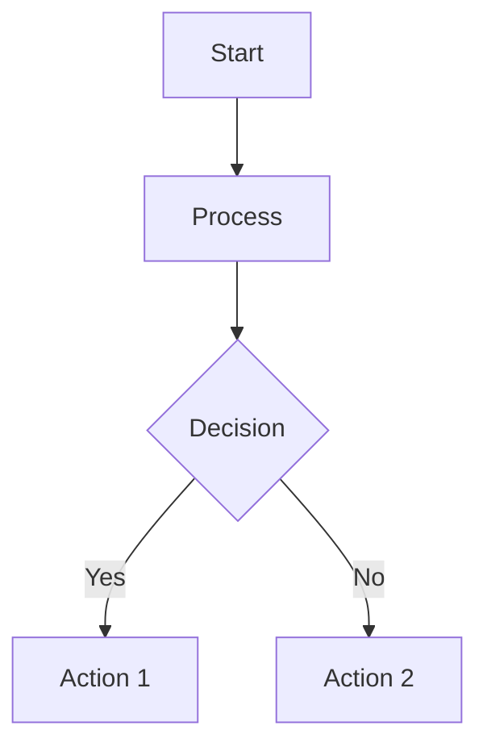

# HakiArdhi Flowcharts

This folder contains professional flowcharts documenting the HakiArdhi Digital Ecosystem workflows.

## 📊 Available Flowcharts

### 1. **Incident Reporting Flow** (`1_incident_reporting_flow.mmd`)
Shows the complete citizen journey for reporting land incidents through WhatsApp, including the three-tier validation system.

**Use for:** Community training, stakeholder presentations, process documentation

---

### 2. **Legal Aid Request Flow** (`2_legal_aid_request_flow.mmd`)
Demonstrates how citizens request legal assistance and how the system intelligently assigns lawyers based on capacity and specialization.

**Use for:** Legal team onboarding, beneficiary orientation, impact presentations

---

### 3. **AI Message Routing** (`3_ai_message_routing.mmd`)
Explains how the AI chatbot processes incoming messages, classifies intent, and routes to appropriate services.

**Use for:** Technical documentation, AI system explanation, developer onboarding

---

### 4. **System Architecture** (`4_system_architecture.mmd`)
High-level technical architecture showing all system layers from user channels to database and external integrations.

**Use for:** Technical presentations, architecture reviews, investor/donor briefings

---

### 5. **Lawyer Assignment Logic** (`5_lawyer_assignment_logic.mmd`)
Details the intelligent algorithm that assigns legal aid cases to lawyers based on workload, specialization, and location.

**Use for:** Legal team training, system optimization discussions, process improvement

---

### 6. **Credibility Screening Process** (`6_credibility_screening.mmd`)
Shows the three-tier validation system (automated → village leader → field officer) for verifying incident reports.

**Use for:** Quality control training, fraud prevention explanation, validation process documentation

---

### 7. **Complete Data Flow** (`7_complete_data_flow.mmd`)
End-to-end technical flow showing how a WhatsApp message travels through all system layers from citizen to database and back.

**Use for:** Technical deep-dives, security reviews, system debugging

---

## 🎨 How to View These Flowcharts

### Option 1: Online Viewer (Easiest)
1. Go to **[Mermaid Live Editor](https://mermaid.live)**
2. Copy the contents of any `.mmd` file
3. Paste into the editor
4. View and export as PNG/SVG/PDF

### Option 2: VS Code (Recommended for Editing)
1. Install **Mermaid Preview** extension in VS Code
2. Open any `.mmd` file
3. Right-click → "Mermaid: Preview"
4. Export to image format

### Option 3: GitHub/GitLab
- These platforms render Mermaid diagrams automatically in markdown files
- Create a `.md` file with:
  ````markdown
  ```mermaid
  [paste .mmd file contents here]
  ```
  ````

### Option 4: Command Line (Convert to Images)
```bash
# Install mermaid-cli
npm install -g @mermaid-js/mermaid-cli

# Convert to PNG
mmdc -i 1_incident_reporting_flow.mmd -o incident_flow.png

# Convert to SVG (better quality)
mmdc -i 1_incident_reporting_flow.mmd -o incident_flow.svg

# Convert to PDF
mmdc -i 1_incident_reporting_flow.mmd -o incident_flow.pdf
```

---

## 📋 Quick Conversion Script

Create a batch script to convert all flowcharts at once:

**Windows (convert_all.bat):**
```batch
@echo off
for %%f in (*.mmd) do (
    echo Converting %%f...
    mmdc -i %%f -o %%~nf.png
)
echo All flowcharts converted to PNG!
```

**Linux/Mac (convert_all.sh):**
```bash
#!/bin/bash
for file in *.mmd; do
    echo "Converting $file..."
    mmdc -i "$file" -o "${file%.mmd}.png"
done
echo "All flowcharts converted to PNG!"
```

---

## 🎯 Usage Recommendations by Audience

### For **Non-Technical Stakeholders** (Community, Donors, Management):
- Use flowcharts #1, #2, #6
- Export to PNG or PDF
- Include in PowerPoint presentations
- Focus on user journey and benefits

### For **Technical Staff** (Developers, System Admins):
- Use flowcharts #3, #4, #7
- Keep in Mermaid format for easy updates
- Include in technical documentation
- Use for troubleshooting and optimization

### For **Field Officers & Legal Team**:
- Use flowcharts #2, #5, #6
- Print as training materials
- Include in standard operating procedures
- Reference during case management

### For **Presentations**:
1. Convert to high-quality SVG or PNG (300 DPI)
2. Add to PowerPoint slides
3. Use progressive disclosure (show one section at a time)
4. Annotate with notes for complex areas

---

## ✏️ Editing Flowcharts

These Mermaid files are text-based and easy to edit:



### Common Mermaid Syntax:
- `[ ]` = Rectangle
- `[( )]` = Rounded rectangle (start/end)
- `{ }` = Diamond (decision)
- `[/ /]` = Parallelogram (input/output)
- `-->` = Arrow
- `-->|Label|` = Labeled arrow
- `style NodeName fill:#color` = Color styling

### Documentation:
- Full Mermaid docs: https://mermaid.js.org/
- Flowchart syntax: https://mermaid.js.org/syntax/flowchart.html

---

## 🔄 Keeping Flowcharts Updated

When system changes are made:
1. Update the corresponding `.mmd` file
2. Re-export to image formats
3. Update documentation references
4. Commit changes to version control

---

## 📞 Need Help?

- **Mermaid Documentation**: https://mermaid.js.org/
- **Live Editor**: https://mermaid.live
- **Community Forum**: https://github.com/mermaid-js/mermaid/discussions

---

**Created for:** HakiArdhi Digital Ecosystem
**Last Updated:** October 2025
**Format:** Mermaid Flowchart (.mmd)
**License:** Internal use only
